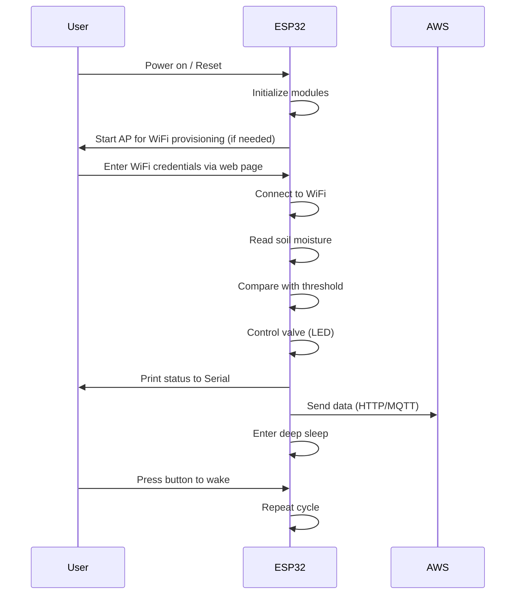

# Smart Irrigation Node for ESP32

## Overview
This project implements a low-power smart irrigation node using an ESP32. The node reads soil moisture, controls a valve (simulated by an LED), simulates LoRaWAN payloads, and sends data to AWS IoT Core via HTTP or MQTT. WiFi credentials are provisioned via an onboard AP and web server. The device enters deep sleep for 1 minute or until a button is pressed to wake up.

## Features
- **Soil Moisture Sensing:** Reads analog values from a potentiometer (simulating a soil moisture sensor) and converts them to a percentage.
- **Actuator Control:** Controls a valve (LED) based on soil moisture threshold. Turns ON if moisture < threshold, OFF otherwise.
- **LoRaWAN Simulation:** Formats and prints payloads (including CRC) to the Serial Monitor, simulating LoRaWAN transmission.
- **AWS IoT Integration:** Sends data to AWS IoT Core using HTTP POST or MQTT publish. Secure connection with device certificates.
- **WiFi Provisioning:** If credentials are missing, the device starts as an AP and serves a web page for SSID/password input. Credentials are saved to EEPROM.
- **Power Optimization:** Uses deep sleep for 1 minute between readings. Can wake up via RTC timer or button press.
- **EEPROM Storage:** Stores moisture threshold and WiFi credentials securely.

## Hardware Requirements
- ESP32 development board
- LED (simulates valve/solenoid)
- Potentiometer (simulates soil moisture sensor)
- Push button (for wake-up)
- Resistors, wires

## System Block Diagram (Graphical)
```mermaid
flowchart TD
    SoilSensor[Potentiometer (Soil Sensor)] -->|Analog| ESP32
    Valve[LED (Valve)] -->|Digital| ESP32
    Button[Push Button] -->|Digital| ESP32
    ESP32 -->|WiFi| Cloud[AWS IoT Core]
    ESP32 -->|Serial| User[Serial Monitor]
```

## Advanced Usage Scenarios
### 1. Remote Monitoring & Control
- Integrate with AWS IoT rules to trigger notifications or control irrigation remotely.
- Use AWS Lambda to process incoming data and update dashboards.
- Add a mobile/web dashboard to visualize soil moisture and control the valve remotely via MQTT.

### 2. Multiple Sensor Nodes
- Deploy multiple ESP32 nodes in different zones.
- Each node publishes to a unique MQTT topic (e.g., `irrigation/zone1`, `irrigation/zone2`).
- Central server or cloud function aggregates data and controls irrigation schedules.

### 3. OTA Updates
- Integrate OTA (Over-the-Air) firmware updates using ArduinoOTA or ESP32 HTTP Update.
- Remotely update logic, thresholds, or add new features without physical access.

### 4. Data Logging
- Log sensor data to AWS DynamoDB or S3 for historical analysis.
- Use AWS IoT Analytics for trend detection and predictive irrigation.

### 5. Security Enhancements
- Use device certificates and AWS IoT policies for secure communication.
- Implement secure boot and flash encryption on ESP32 for tamper resistance.

## Additional Documentation
### Class Responsibilities
- **SoilMoistureSensor:** Reads and processes analog soil moisture data.
- **ValveActuator:** Controls irrigation valve (LED) and supports power saving.
- **ThresholdConfig:** Stores/retrieves threshold from EEPROM.
- **CRC8:** Ensures payload integrity for LoRaWAN simulation.
- **LoRaWAN:** Simulates LoRaWAN packet format and prints to Serial.
- **WiFiManager:** Handles WiFi provisioning, connection, and deinit.
- **CloudClient:** Sends data to AWS IoT Core via HTTP/MQTT, manages secure connections.
- **SmartIrrigationNode:** Orchestrates all modules, manages cycles, sleep/wake logic.

### Main Logic Flow


### Example AWS IoT Rule
```sql
SELECT * FROM 'irrigation/data' WHERE moisture < 30
```
- Triggers an alert or Lambda function if soil moisture drops below threshold.

### Example Serial Output
```
Soil moisture: 28%
Threshold: 30
Valve ON
LoRaWAN Payload: 0x1C 0x1E CRC: 0x02
AWS HTTP POST Response: 200
Entering deep sleep...
```

### Example WiFi Provisioning Web Page
```
http://192.168.4.1/
------------------
WiFi Provisioning
SSID: [__________]
Password: [__________]
[Save]
```

## Troubleshooting
- **Include Errors:** Make sure you have ESP32 board support and all required libraries installed in Arduino IDE.
- **AWS Connection:** Ensure certificates and endpoint are correct. Check your AWS IoT policy.
- **WiFi Provisioning:** If AP does not appear, reset the device or erase EEPROM.
- **Button Wake-Up:** Ensure button is wired to `BUTTON_PIN` and ground, and is active LOW.
- **Serial Monitor:** Use 115200 baud rate for best results.

## License
MIT License

## Author
Viral Mistry

---
For questions or improvements, open an issue or contact the author.
